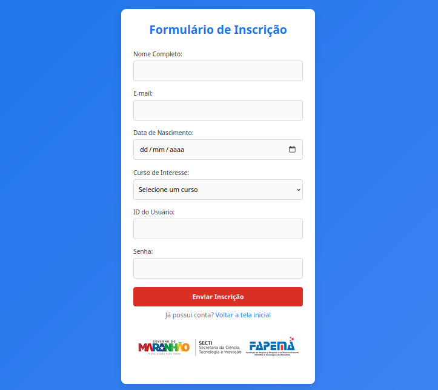

# Trilha Desafio 3 - Desenvolvimento do Formulário Interativo

​Este projeto tem como objetivo desenvolver um formulário interativo que incorpore validação de dados e regras de negócio essenciais, garantindo a integridade e a precisão das informações fornecidas pelos usuários. A implementação de validações adequadas assegura que os dados inseridos atendam aos critérios estabelecidos, enquanto a aplicação das regras de negócio permite que o sistema funcione conforme os requisitos específicos da organização.

O projeto foi desenvolvido usando **HTML**, **CSS** e **Javascript**, e para rodar localmente bastar baixar o repositório e abrir o arquivo ```login.html``` no seu navegador de preferência


## Processo de Implementação

No processo inicial do projeto foi iniciado pela tela de cadrasto a qual foi adicionada ao formulário com base do projeto antigo os campos de **ID do Usuário** e **Senha** definindo também um botão para fazer envio das informações, a página foi desenvolvinda pensando sobre como se adaptaria em todos os tipos de tela de maneira mais responsiva possível.

a tela de casdrasto se encontra no arquivo ```telaDecadrastro.html```, na qual ficou da seguinte maneira:



###  Validação de Campos com JavaScript
Após isso é feita a validação dos dados definidas no arquivo ```cadrasto.js``` seguindos das seguintes regras:

- **Preenchimento Obrigatório de Todos os Campos:** Garanta que nenhum campo do formulário seja deixado em branco antes do envio.

- **Verificação de E-mail Válido:** Assegure que o campo de e-mail contenha um endereço válido. Por exemplo, `email@exemplo.com` é válido, enquanto `20979` não é. Utilize expressões regulares para essa validação.

- **Veficação de nome, id e senha**:
    - **nome e id**: no mínino 3 cacteres;
    - **senha**: no mínimo 6 caracteres.


- **Exibição de Mensagens de Erro:** Apresente mensagens de erro específicas abaixo de cada campo que não atender aos critérios de validação, fornecendo feedback claro ao usuário.

- **Armazenamento Temporário dos Dados**: Utilizando ```localStorage``` do navegador para armazenar temporariamente os dados do formulário, possibilitando a recuperação das informações em caso de falha ou recarga da página. ​

## Criação de Tela de Login

Por fim foi desenvolvida uma tela de login onde o usuário possa acessar utilizando o ID e a senha previamente cadastrados. ficando definida da seguinte maneira:


Para testar o login basta usar as credenciais: 
- **ID do Usuário**: ```teste123```
- **Senha**: ```senha123```

Não nenhuma conexão com quais quer banco de dados é apenas para fins de teste

# Conclusão

Participar deste desafio proporcionou uma oportunidade valiosa para aplicar os conhecimentos adquiridos, permitindo observar sua aplicação prática de forma concreta. Essa experiência reforçou a importância de transformar teoria em prática, consolidando o aprendizado e destacando a relevância de enfrentar desafios como oportunidades de crescimento e desenvolvimento profissional.