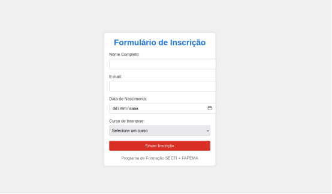

# Processo de Implementação

Nesta atividade, desenvolveu-se um formulário de inscrição simples utilizando tecnologias fundamentais da web: **HTML**, **CSS** e **JavaScript**, sem o uso de frameworks ou bibliotecas externas. O objetivo principal foi criar uma interface limpa, funcional e responsiva para a coleta de dados básicos do usuário, servindo como base introdutória para compreender a estrutura e o funcionamento de formulários na web.

## Estrutura HTML

A estrutura do formulário foi construída com **HTML5** de maneira semântica, garantindo acessibilidade e usabilidade. Foram incluídos quatro campos principais:

1. **Nome Completo**: campo de texto.
2. **E-mail**: campo do tipo email.
3. **Data de Nascimento**: campo de data.
4. **Curso de Interesse**: menu suspenso com as opções:
   - Desenvolvimento Frontend
   - Desenvolvimento Backend
   - Desenvolvimento Fullstack

Todos os campos são obrigatórios (`required`) e acompanhados de seus respectivos rótulos (`<label>`), facilitando a navegação e compreensão do conteúdo pelo usuário. Um botão do tipo `submit` foi adicionado ao final para envio dos dados.

## Estrutura CSS

A estilização foi realizada com **CSS puro**, iniciando com um reset básico para remover margens e espaçamentos padrões de elementos como `body`, `label`, `input` e `button`. O corpo da página foi centralizado utilizando **Flexbox**, com altura total da tela, garantindo que o formulário apareça centralizado vertical e horizontalmente.

O formulário foi encapsulado em uma `div` com a classe `container`, que recebeu um visual de cartão: fundo branco, bordas arredondadas, sombra suave e espaçamento interno, limitando sua largura para melhor visualização em diferentes dispositivos. Os campos de entrada foram estilizados para ocupar 100% da largura, com preenchimento interno, bordas discretas e espaçamento entre si. O botão de envio recebeu cor vermelha para destaque, com texto branco e efeito *hover* que escurece o botão ao passar o mouse, aumentando a interatividade. O rodapé, centralizado abaixo do formulário, exibe uma mensagem institucional simples.

## Estrutura JavaScript

O **JavaScript** foi utilizado para adicionar interatividade ao formulário, simulando o envio de dados. Primeiramente, o formulário foi selecionado via `document.getElementById()`, e um evento de `submit` foi capturado com `addEventListener`. Quando o usuário clica no botão de envio, o método `event.preventDefault()` impede o envio padrão (que recarregaria a página). Em seguida, é exibido um `alert()` com a mensagem de confirmação da inscrição, simulando o sucesso do envio. Por fim, o método `reset()` limpa os campos do formulário, preparando-o para uma nova entrada.

De forma geral, a implementação foi simples, clara e eficiente, com foco na construção de um formulário funcional e bem apresentado. O exercício foi útil para reforçar conhecimentos básicos de *front-end*, como estrutura semântica em HTML, uso de Flexbox no CSS e manipulação de eventos com JavaScript.

## Resultado Final



Além de alguns problemas na parte lógica no arquivo JavaScript, também são perceptíveis alguns problemas estruturais no HTML e CSS que serão otimizados durante o Desafio 3. Todo o processo é documentado neste repositório no arquivo `README.md`.


## Melhorias a serem implementadas na página HTML/CSS existente


## 1. Validação de Campos com JavaScript

- **Verificação de E-mail Válido:** Assegure que o campo de e-mail contenha um endereço válido. Por exemplo, `email@exemplo.com` é válido, enquanto `20979` não é. Utilize expressões regulares para essa validação.

- **Preenchimento Obrigatório de Todos os Campos:** Garanta que nenhum campo do formulário seja deixado em branco antes do envio.

- **Exibição de Mensagens de Erro:** Apresente mensagens de erro específicas abaixo de cada campo que não atender aos critérios de validação, fornecendo feedback claro ao usuário.

## 2. Adição de Novos Campos ao Formulário

- **ID do Usuário e Senha:** : Inclua campos para que o usuário defina um identificador único e uma senha segura

## 3. Botão para Salvar Informações

- Adicione um botão que permita ao usuário salvar temporariamente as informações preenchidas.

## 4. Armazenamento Temporário dos Dados

- Utilize o ```localStorage``` ou ```sessionStorage``` do navegador para armazenar temporariamente os dados do formulário, possibilitando a recuperação das informações em caso de falha ou recarga da página. ​

## 5. Criação de Tela de Login

Desenvolva uma tela de login onde o usuário possa acessar utilizando o ID e a senha previamente cadastrados.
## 6. Responsividade

- Assegure que a página seja totalmente responsiva, proporcionando uma experiência de uso consistente em dispositivos de diferentes tamanhos de tela.

## 7. Confirmação de Inscrição

- Após o envio bem-sucedido do formulário, exiba uma mensagem ou alerta confirmando que a inscrição foi realizada com sucesso.